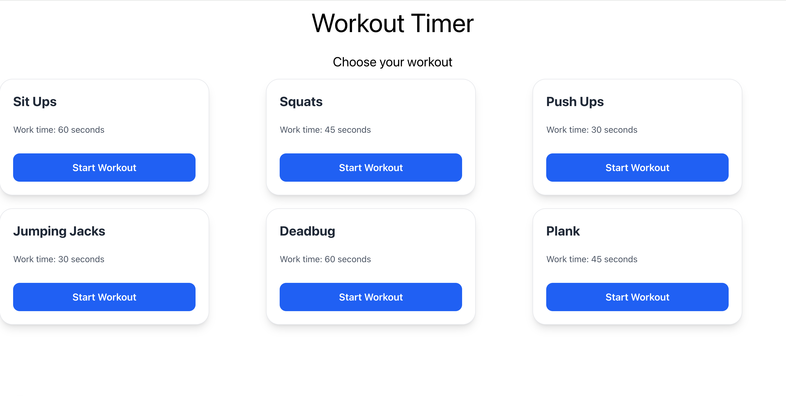
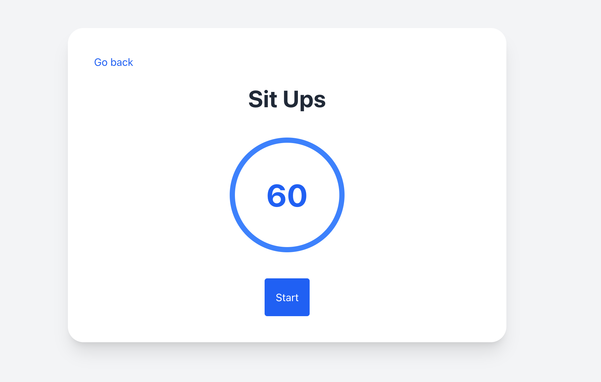
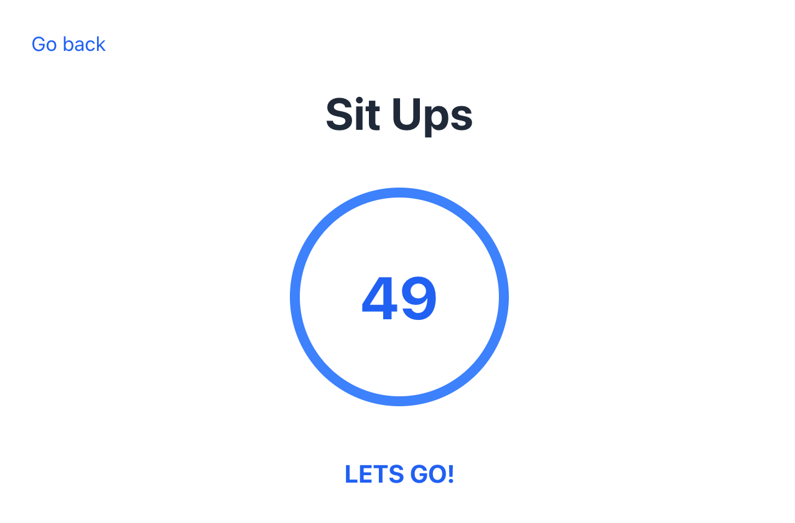
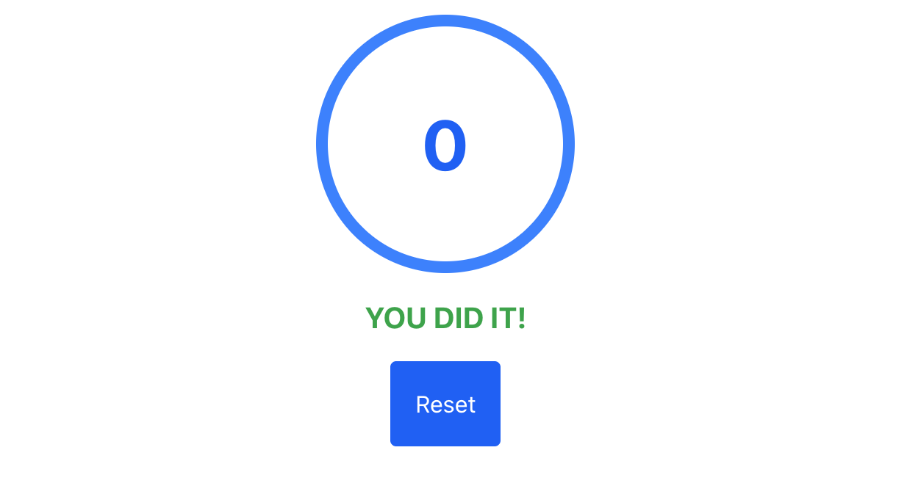

# Proposal:

## Workout timer

On homepage, choose between workouts. 
when clicked "start workout" the workout shows (activeWorkout) with a timer. 
click start to start the countdown timer.

when started, the button changes text to "lets go"!

when workout is completed, timer is 0, a text with "you did it" shows up, and a reset button. 

click the reset button to go back to initial timer countdown. click start to do it again. 

click the "go back" button to go back to the homepage, with all the workout selections. 

